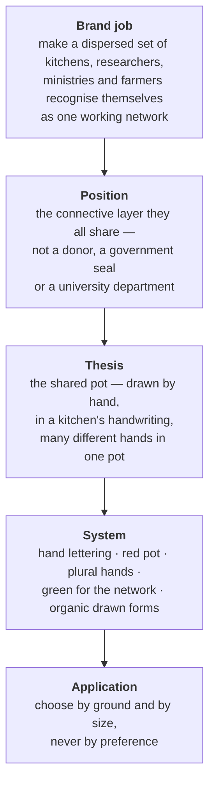

# Cozinha Solidária em Rede — brand book

This document teaches the identity well enough to make new work with it. It is not a
serialisation of [`brand-spec.json`](./brand-spec.json); the spec is the machine contract
and the full record of evidence and open questions, while this book explains why the
system behaves the way it does and how to apply it.

The identity was designed by Lucas Melara (LM&Co.) and delivered as a 82-artboard
Illustrator manual in June 2026. Everything here is reconstructed from that native file —
no value was retyped from a screenshot and no artwork was traced. Where this book departs
from the 2026 manual, it says so and gives the reason.

## The logic

The project is a research-action network, not a food programme. It does not cook or
distribute; it builds the intersectoral model and supports the kitchens and farmers who
do. That distinction is the reason the identity reads as handmade rather than
institutional: an institutional mark would position the project above the kitchens, and
the whole argument is that it sits among them.

**Em Rede is load-bearing.** A Brazilian federal programme shares the name _Cozinha
Solidária_. "Em Rede" is what separates this project from it, which is why it is dropped
only in the reduced pot badge, where the pot alone signs.

## The mark

The signature is hand-drawn lettering locked to a red pot holding three hands of
different skin tones. Two properties carry the meaning and neither is negotiable:

**The lettering is artwork, not type.** No font reproduces it. Scale the master; never
re-set the name, and never letterspace, condense or slant it. There is one exception
worth stating because it will come up: where a system genuinely cannot place an image —
a plain-text email signature, an `alt` attribute — write the name as ordinary text. That
is text, not a logo, and it should not be styled to imitate one.

**The hands stay plural and stay different.** Three tones is the minimum expression of
the idea. Reducing them to one hand or one tone does not simplify the mark, it contradicts
it. In single-ink production the hands survive as cut-outs knocked out of a filled pot —
that is why the monochrome variants look the way they do, and why a solid silhouette
version would be a worse simplification than it appears.

### Lockups

| Lockup       | Shape                           | Use                                                                   |
| ------------ | ------------------------------- | --------------------------------------------------------------------- |
| `vertical`   | name above pot, _Em Rede_ below | Primary signature. Default unless something argues otherwise.         |
| `horizontal` | pot left, name right            | Wide, short spaces — site headers, document footers, banners.         |
| `stacked`    | pot above, name below           | Tall, narrow spaces.                                                  |
| `wordmark`   | lettering only                  | Where the pot already appears nearby and repeating it would be noise. |
| `badge-pot`  | pot in a green disc             | Avatars, favicons, stamps. The only asset that survives below 90px.   |
| `badge-csr`  | CSR monogram in a grey disc     | Secondary; only where the abbreviation is already understood.         |

### Choosing a variant

Every lockup ships in six variants. Pick by the ground, not by taste — a version chosen
against its ground is the most common way this system fails.

| Ground                                                  | Variant         | File                              |
| ------------------------------------------------------- | --------------- | --------------------------------- |
| Light surface (Branco Leitura, paper, pale photography) | `color`         | `logo/<lockup>-color.svg`         |
| Dark surface (Preto or near-black)                      | `color-on-dark` | `logo/<lockup>-color-on-dark.svg` |
| Dark or photographic, single ink                        | `white`         | `logo/<lockup>-white.svg`         |
| Light, single ink                                       | `black`         | `logo/<lockup>-black.svg`         |
| Only the brand red available                            | `red`           | `logo/<lockup>-red.svg`           |
| Only the brand green available                          | `green`         | `logo/<lockup>-green.svg`         |

On a busy photograph, put a plain ground behind the mark. The hand lettering loses its
counters before anything else does, and once they close the name stops being readable at
any size.

### Clear space and minimum size

Clear space is the **`e` of _Em Rede_**, scaled with the mark, on every contour. Nothing
enters it — not partner marks, not the page edge, not image content. Using a letter from
the mark itself means the margin scales correctly without anyone computing a ratio.

Minimum sizes were measured by rendering the masters and reading where the lettering
closes up, not assumed from the artboard:

| Lockup                | Minimum width | What fails first below it |
| --------------------- | ------------- | ------------------------- |
| `horizontal`          | 120 px        | _Em Rede_ fills in        |
| `vertical`, `stacked` | 90 px         | _Em Rede_ fills in        |
| `badge-pot`           | 24 px         | the hands blur together   |

Below 90 px, stop scaling the full signature down and switch to `badge-pot`. That is what
it is for.

### What breaks the mark

Do not distort, stretch or rotate. Do not recolour outside the six variants. Do not place
a light variant on a light ground or a dark variant on a dark ground. Do not violate the
clear-space margin. Do not present the UNIFESP mark as this project's own — UNIFESP is an
institutional condition of the brief and signs as a partner, never as the identity.

## Colour

Two colours carry meaning and the roles are fixed: **red is the pot and the kitchen,
green is the network** and sets _Em Rede_. Swapping those roles damages recognition faster
than changing the hues would. The three skin tones belong to the hands; they are not a
decorative palette and should not appear as surfaces or accents.

| Token          | Value     | Role                                                |
| -------------- | --------- | --------------------------------------------------- |
| Vermelho       | `#AE1616` | The pot. Primary brand colour.                      |
| Verde UNIFESP  | `#1E5A36` | The network, on light grounds.                      |
| Verde Claro    | `#559870` | The network, on dark grounds.                       |
| Branco Leitura | `#FAFAFA` | Reading surface and reversed text.                  |
| Preto          | `#000000` | The name on light grounds; the brand's dark ground. |
| Pele Clara     | `#E9BBAF` | Hand.                                               |
| Pele Parda     | `#AE7F74` | Hand.                                               |
| Pele Negra     | `#422018` | Hand.                                               |

Logo knock-outs use pure `#FFFFFF` rather than Branco Leitura, because there the white is
ink absence, not a surface colour.

**Two departures from the 2026 manual, both deliberate.**

The manual documents the red as `#B21616`. Every native master draws it as `#AE1616` — as
do the logo SVGs already deployed in this repository — and the manual's own printed swatch
renders as a third value. The artwork is self-consistent and the typed documentation is
not, so `#AE1616` is canonical here.

The manual sets _Em Rede_ in Verde UNIFESP on dark grounds, where it measures **1.99:1** and
is effectively illegible. The `color-on-dark` variants therefore use **Verde Claro
`#559870`** — a green already present in the artwork as the pot badge's disc — which
measures 4.73:1 on near-black and 6.11:1 on pure black. Nothing else about those lockups
changed. This is the same principle the manual states itself when it forbids a dark
version on a dark ground; it simply did not catch its own instance of it.

Verde Claro exists for display lettering at 90 px and above. **Body text on dark grounds
is Branco Leitura**, not Verde Claro.

### Verified pairings

| Text           | Ground         | Ratio                          |
| -------------- | -------------- | ------------------------------ |
| Preto          | Branco Leitura | 20.1:1                         |
| Verde UNIFESP  | Branco Leitura | 7.8:1                          |
| Vermelho       | Branco Leitura | 6.9:1                          |
| Branco Leitura | Verde UNIFESP  | 7.8:1                          |
| Branco Leitura | Vermelho       | 6.9:1                          |
| Verde Claro    | Preto          | 6.1:1 (display lettering only) |

Vermelho on a dark ground measures 2.3:1 and must not carry text. In the `color-on-dark`
lockups the pot is still red, but it reads through its white knock-outs and the white
lettering beside it, not through its own contrast against the ground.

For print, the manual's CMYK and PANTONE references are inherited unverified. PANTONE 327 C
is a published teal and does not match the forest green it is paired with. **Confirm every
spot reference against a physical guide before a spot run** — see `E-003` in the spec.

## Typography

The name is custom lettering and has no font equivalent. Around it:

- **Headings** — Neue Haas Grotesk Display 75 Bold
- **Body** — Neue Haas Grotesk Display 45 Light

The weight jump, not size alone, carries the hierarchy. Where Neue Haas Grotesk is not
licensed, substitute a neutral grotesque of similar proportion and record the
substitution; a humanist or geometric face would compete with the hand lettering instead
of receding behind it. Licence coverage for this project is unconfirmed.

## Illustration and pattern

Thirty-four drawn food pieces — fruit, vegetables, fish, eggs, rice and beans, preserves.
Flat and organic, built entirely from filled shapes: there is not a single `stroke` in the
set, and where a piece appears to have a contour it is a dark shape sitting behind a
lighter one. Keep that construction when extending the set; an outlined addition will not
sit with the rest.

**Twenty-four are vector masters** in [`illustration/`](./illustration) and behave like
the logo files — scale them freely. **Ten are raster-only** in
[`illustration/raster-only/`](./illustration/raster-only), because the handoff never
included their vector source. Those ten are small PNGs, between 182×238 and 313×213: use
them at or below their pixel size, never enlarged, never recoloured, and never in print at
size. They are a stopgap that ends when the designer supplies the source file.

They depict **real Brazilian everyday food**, not generic healthy-eating iconography. That
specificity is the point: rice and beans, papaya, a preserve jar and a sardine say
something about whose kitchen this is that a stock salad bowl does not. Any extension of
the set should hold that line.

**The illustrations do not use the brand palette, and should not be corrected to it.**
The set spans 81 colours — food-naturalistic reds, greens, blues and oranges chosen so a
carrot looks like a carrot. Brand colours appear only where a piece actually carries the
logo, as on the preserve jar. The system's coherence here comes from the drawing hand and
the flat fill construction, not from shared hues, and forcing the palette onto them would
cost the realism without buying any recognition.

The pattern in [`pattern/`](./pattern) is a seamless 280×280 tile, verified by repetition
at several scales. It is a texture — keep it behind content and out of the logo's clear
space. Two inks ship: `foods-tile.svg` for light grounds and `foods-tile-white.svg` for
dark, because the dark ink disappears on a dark surface.

Photography, where used, shows real kitchens, real hands and food actually being prepared
— not styled studio plates.

## Open questions

Four things this book cannot settle on its own; all four are recorded in the spec under
`unresolved`.

The most consequential: **ten of the thirty-four illustrations have no vector master.**
The handoff delivered them only as small PNG exports, so they cannot be scaled, recoloured
or printed at size. Requesting the illustration source file from the designer closes this
properly; nothing else does.

The others: whether the project holds a Neue Haas Grotesk licence; whether the spot-colour
references survive a physical check; and whether the CSR badge is still in use and what it
abbreviates — the manual shows it without explanation.
