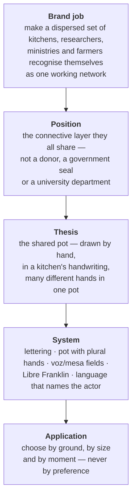
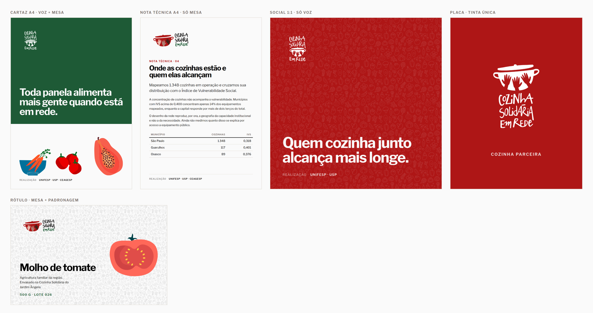

# Cozinha Solidária em Rede — brand book

This document teaches the identity well enough to make new work with it. It is not a
serialisation of [`brand-spec.json`](./brand-spec.json); the spec is the machine contract
and the full record of evidence and open questions, while this book explains why the
system behaves the way it does.

The mark, the lettering, the illustrations and the pattern come from the identity
delivered by Lucas Melara (LM&Co.) in June 2026. The system around them — typography,
composition, voice and the partner signature — was designed here, on top of that work,
because the handoff resolved the signature but not what to do with it. Every rule below
was tested by building the artefact and looking at it; where a rule exists, something
failed first.

## The logic

The project is a research-action network, not a food programme. It does not cook or
distribute; it builds the intersectoral model and supports the kitchens and farmers who
do. That distinction is why the identity reads as handmade rather than institutional: an
institutional mark would position the project above the kitchens, and the whole argument
is that it sits among them.

**Em Rede is load-bearing.** A Brazilian federal programme shares the name _Cozinha
Solidária_. "Em Rede" is what separates this project from it, which is why it is dropped
only in the reduced pot badge, where the pot alone signs.

## The mark

Hand-drawn lettering locked to a red pot holding three hands of different skin tones. Two
properties carry the meaning and neither is negotiable.

**The lettering is artwork, not type.** No font reproduces it. Scale the master; never
re-set the name, and never letterspace, condense or slant it. One exception, because it
will come up: where a system genuinely cannot place an image — a plain-text signature, an
`alt` attribute — write the name as ordinary text. That is text, not a logo, and should
not be styled to imitate one.

**The hands stay plural and stay different.** Three tones is the minimum expression of the
idea. Reducing them to one hand or one tone does not simplify the mark, it contradicts it.
In single-ink production the hands survive as cut-outs knocked out of a filled pot — which
is why the monochrome variants look the way they do, and why a solid silhouette would be a
worse simplification than it appears.

### Lockups

| Lockup       | Shape                           | Use                                                                   |
| ------------ | ------------------------------- | --------------------------------------------------------------------- |
| `vertical`   | name above pot, _Em Rede_ below | Primary signature. Default unless something argues otherwise.         |
| `horizontal` | pot left, name right            | Wide, short spaces — headers, document footers, banners.              |
| `stacked`    | pot above, name below           | Tall, narrow spaces.                                                  |
| `wordmark`   | lettering only                  | Where the pot already appears nearby and repeating it would be noise. |
| `badge-pot`  | pot in a green disc             | Avatars, favicons, stamps. The only asset that survives below 90px.   |
| `badge-csr`  | CSR monogram in a grey disc     | Secondary; only where the abbreviation is already understood.         |

### Choosing a variant — by ground, never by taste

| Ground                              | Variant                    |
| ----------------------------------- | -------------------------- |
| Branco Leitura, paper, pale imagery | `color`                    |
| Preto or neutral dark               | `color-on-dark`            |
| **Vermelho or Verde**               | **`white`**                |
| Single-ink production               | `black`, `red` or `green`  |
| Photography                         | `white`, over a plain area |

The third row is the one people get wrong, and it is not a matter of preference. On
Vermelho the pot is `#AE1616` on `#AE1616` and vanishes, leaving a lettering fragment
floating over nothing. On Verde the _Em Rede_ lettering falls to 2.38:1. Both were built
and photographed before this rule existed; the white lockup fixes both.

### Clear space and minimum size

Clear space is the **`e` of _Em Rede_**, scaled with the mark, on every contour. Nothing
enters it. Using a letter from the mark itself means the margin scales correctly without
anyone computing a ratio.

Minimum sizes were measured by rendering the masters and reading where the lettering
closes up:

| Lockup                | Minimum width | What fails first below it |
| --------------------- | ------------- | ------------------------- |
| `horizontal`          | 120 px        | _Em Rede_ fills in        |
| `vertical`, `stacked` | 90 px         | _Em Rede_ fills in        |
| `badge-pot`           | 24 px         | the hands blur together   |

Below 90 px, stop scaling the signature down and switch to `badge-pot`. That is what it is
for.

### What breaks the mark

Do not distort, stretch or rotate. Do not recolour outside the declared variants. Do not
place a lockup on a ground that matches one of its own inks. Do not place a light variant
on a light ground or a dark variant on a dark ground. Do not violate the clear-space
margin. Do not present the UNIFESP mark as this project's own.

## Composition — voz and mesa

Every brand surface is built from two fields.

**Voz** is a flat brand colour — Vermelho, Verde or Preto. It carries the signature, the
headline and the partner line. **It never carries illustration.**

**Mesa** is Branco Leitura. It carries the food, the data, the body text, the long read.

A surface may be all voz (a social post), all mesa (a technical note), or split between
them on a straight horizontal edge (a poster). Look at
[`reference/applications.png`](./reference/applications.png): five pieces with different
jobs, one grammar.

**Why the split exists.** The illustration set runs on its own naturalistic palette — 81
colours chosen so a carrot looks like a carrot. Put a cerulean bowl on Verde UNIFESP and
nothing shares a hue; the piece falls apart. The obvious fix is to recolour the
illustrations to the brand palette, which would cost the realism that makes them specific
to a Brazilian kitchen. The split fixes it structurally instead: food goes on the plate,
not on the tablecloth. It also restates the mark's own logic — the pot contains, the
ingredients arrive.

The rules that follow from it:

- The split is a **straight horizontal edge** across the full width. Do not feather, curve,
  angle or round it. The drawing in this system is done by the lettering and the
  illustrations; the layout holds still so they can move.
- Proportion is free but **never half and half** — one field dominates, or the surface
  reads as two unrelated posters.
- The signature sits in the voz field, top-left, inside its clear space. On an all-mesa
  surface, top-left of the page margin.
- Illustrations sit on mesa, **anchored to its bottom edge**, large and overlapping —
  arriving, not arranged in a grid. Never below 40% of the mesa's height; smaller than that
  they read as icons, and the set is not an icon set.
- The pattern is the only texture permitted on voz, at low opacity behind everything.

**What must stay constant:** the two fields, the straight edge, the signature top-left,
food only on mesa. **What may vary freely:** which colour voz takes, the split proportion,
which field dominates, how many illustrations arrive and how they overlap.

## Typography

The name is custom lettering and has no font equivalent. Everything around it is
**Libre Franklin** — one family across display and text, openly licensed under the SIL
Open Font License 1.1 and available from Google Fonts, so vendors and partners can install
it without a purchase.

| Role    | Setting                                  |
| ------- | ---------------------------------------- |
| Display | 700, tracking −0.035em, line-height 0.99 |
| Heading | 700, tracking −0.03em                    |
| Lead    | 300, **18px and above only**             |
| Body    | 400, 17px and below                      |
| Label   | 600 uppercase, tracking 0.11em           |

Weight and tracking carry the hierarchy, not a size ratio. Display and heading are the
same weight; size and measure separate them.

**Two departures from the 2026 manual.** It specified Neue Haas Grotesk, a commercial
licence whose coverage for this project was never confirmed — a blocker on every touchpoint.
Libre Franklin is openly licensed, covers the pt-BR diacritics, and sets the same copy in
fewer lines than the alternatives tested, which matters because research and policy
documents are a declared touchpoint. It also specified Light for body text; at 14.5px that
thins out in print and on poor screens, so Light is restricted to 18px and above.

Headlines are left-aligned and ragged right. Do not centre or justify — the lettering is
already irregular and a centred axis fights it.

Where Libre Franklin cannot be installed, substitute a neutral grotesque of similar width
and x-height and record the substitution. Not a humanist or geometric face: those compete
with the lettering instead of receding behind it.

## Voice

The visual system says the project is handmade and plural. The language has to say the
same thing, or the brand contradicts itself the moment anyone writes a sentence.

**Name the actor.** Write who does what — _as cozinhas alcançam_, not _é alcançado_. The
passive voice hides who feeds whom, and who does the work is this brand's entire argument.

**Numbers carry the argument; adjectives do not.** _1.348 cozinhas em operação_, not
_milhares de cozinhas_. Where there is no number, say what was observed rather than reach
for an intensifier.

**Cook, do not feed.** Nobody here is a recipient. Write _quem cozinha_, _as cozinhas_,
_a rede_. Never _beneficiários_, _carentes_, _doação_, _ajudar quem precisa_. This is the
single rule that most separates this project from the charity brands it sits beside.

**State, then draw the consequence.** One short sentence carrying the fact, one carrying
what it implies. Do not stack subordinate clauses — that is policy writing's default
failure and it makes the network sound like a ministry.

**Say _ainda não_ out loud.** This is research. Naming what has not been measured is
credibility, not weakness.

### Tone by moment

| Moment                   | How it changes                                                                                          |
| ------------------------ | ------------------------------------------------------------------------------------------------------- |
| Institutional and policy | Precise, numbered. No metaphor — the pot does not appear in the language when the reader is a ministry. |
| Territory and kitchens   | Direct, second person, about the next step: _sua cozinha pode entrar na rede_.                          |
| Campaign and social      | One idea, the strongest single sentence, nothing explaining it afterwards.                              |
| Data and technical notes | State the finding, then its limit, in the same breath.                                                  |

### Never

Charity register (_doação_, _carente_, _beneficiário_). Development-sector autocomplete
(_empoderar_, _impactar_, _solução inovadora_, _juntos podemos_). Exclamation marks. And
any sentence that would survive unchanged with a generic NGO's name in place of this one —
if it survives, it was not about this project.

## Partner signature

The project signs its own work; the institutions that make it possible sign beneath.

The partner line is one row in the label style: the word **Realização** at reduced opacity,
then the institution names separated by middots. It sits in a **reserved strip at the foot
of the surface that nothing else may enter** — no illustration, no image, no text. That
strip is the partner equivalent of the logo's clear space, and it exists because the first
build without it put the carrots through the middle of UNIFESP.

Partner logotypes are used only where an institution's own rules require the mark rather
than the name. Then they sit in the same strip, optically matched in height **to each
other**, never to the project's signature.

Setting partners as text by default keeps the project legible as the network rather than
as a university output, and stops a row of competing logos from crowding the signature.
UNIFESP is a condition of the brief, not a co-brand.

## Illustration and pattern

Thirty-four drawn food pieces. Flat and organic, built entirely from filled shapes: there
is not a single `stroke` in the set, and where a piece appears to have a contour it is a
dark shape sitting behind a lighter one. Keep that construction when extending the set.

All thirty-four are vector masters in [`illustration/`](./illustration) and scale freely.
Twenty-four came out of the native Illustrator file. The other ten had no vector source in
the handoff and were reconstructed from the delivered PNG exports — the art is flat
colour, so the regions were separated and refitted rather than traced blind, and each was
checked against its source on white and on grey, where the near-white highlights the page
hides become visible. They are faithful, but they are a reconstruction: heavier in nodes
than a hand-drawn path, and their finest contours carry the resolution of a ~250px export.
If the set is ever reworked, ask the designer for the original file.

They depict **real Brazilian everyday food**, not healthy-eating iconography. Rice and
beans, papaya, a preserve jar and a sardine say something about whose kitchen this is that
a stock salad bowl does not.

**The set does not use the brand palette and must not be corrected to it.** Its coherence
comes from the drawing hand and the flat fill construction, not shared hues. The voz/mesa
split is what reconciles it with the brand colours; recolouring is not.

The pattern in [`pattern/`](./pattern) is a seamless 280×280 tile, verified by repetition
at several scales. It is a texture — behind content, out of the logo's clear space. Two
inks: `foods-tile.svg` for light grounds, `foods-tile-white.svg` for dark.

Photography, where used, shows real kitchens, real hands and food being prepared — not
styled studio plates.

## Colour

Two colours carry meaning, and the roles are fixed: **red is the pot and the kitchen,
green is the network** and sets _Em Rede_. Swapping those roles damages recognition faster
than changing the hues would. The three skin tones belong to the hands; they are not a
decorative palette.

| Token                      | Value                         | Role                                                |
| -------------------------- | ----------------------------- | --------------------------------------------------- |
| Vermelho                   | `#AE1616`                     | The pot. Primary.                                   |
| Verde UNIFESP              | `#1E5A36`                     | The network, on light grounds.                      |
| Verde Claro                | `#559870`                     | The network, on **neutral dark** grounds only.      |
| Branco Leitura             | `#FAFAFA`                     | The mesa field and reversed text.                   |
| Preto                      | `#000000`                     | The name on light grounds; the neutral dark ground. |
| Pele Clara / Parda / Negra | `#E9BBAF` `#AE7F74` `#422018` | The hands.                                          |

Logo knock-outs use pure `#FFFFFF`, because there the white is ink absence, not a surface.

**The red differs from the manual.** It documents `#B21616`; every native master draws
`#AE1616`, and the manual's own printed swatch renders a third value. The artwork is
self-consistent and the documentation is not, so `#AE1616` is canonical.

**Verde UNIFESP cannot go on dark.** It measures 1.99:1 on near-black — the _Em Rede_
lettering in the manual's own dark lockup is effectively invisible. The `color-on-dark`
variants use **Verde Claro `#559870`**, a green already present in the artwork as the pot
badge's disc, at 4.73:1 and 6.11:1. Verde Claro is for display lettering at 90px and above
on neutral dark; it is **not** for text, and never for text on Verde, where it is 2.38:1.

### Verified pairings

| Text           | Ground         | Ratio                          |
| -------------- | -------------- | ------------------------------ |
| Preto          | Branco Leitura | 20.1:1                         |
| Verde UNIFESP  | Branco Leitura | 7.8:1                          |
| Vermelho       | Branco Leitura | 6.9:1                          |
| Branco Leitura | Verde UNIFESP  | 7.8:1                          |
| Branco Leitura | Vermelho       | 6.9:1                          |
| Verde Claro    | Preto          | 6.1:1 (display lettering only) |

On a saturated brand ground, text is Branco Leitura. Vermelho on dark is 2.3:1 and must
not carry text.

**For print, nothing has been proofed.** PANTONE 327 C as printed in the 2026 manual is a
teal and does not match the green it is paired with — do not forward those numbers to a
printer. Print from the CMYK builds, treat them as unverified, and proof on press.

## Open questions

Three things this book cannot settle; all three are in the spec under `unresolved`.

No print proof exists, so every spot and CMYK reference is unverified. The illustration
source file was never delivered — nothing is blocked now that the ten pieces are vector,
but the designer's own geometry would be better to edit from. And the CSR badge appears in
the manual without explanation: find out whether anything still depends on it, and retire
it if not.
